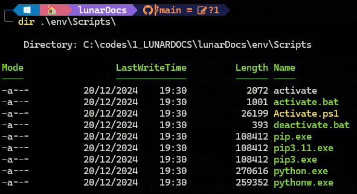

# lunarDocs

H4ck3r public mkdocs with [Material for MkDocs](https://squidfunk.github.io/mkdocs-material/), work in progress...

Just learning about machines.


## Make a virtual env on win OS

```
python.exe -m venv env
```



- To activate : \env\Scripts\activate
- To deactivate: \env\Scripts\deactivate.bat
- To delete : simply delete the folder 

## Install material

```bash
$ pip install mkdocs-material
```

Check version :

```bash
$ pip list | grep material
mkdocs-material            9.5.49
mkdocs-material-extensions 1.3.1
```

**WARNING :**
> Upgrade mkdocs-material like this : `pip install --upgrade --force-reinstall mkdocs-material`

## Clone lunarDocs

```bash
git clone git@github.com:rnek0/lunarDocs.git
```

## Write & serve

```bash
mkdocs serve
```

## Build

```bash
mkdocs build
```

## Git cmds

```bash
git pull
git status
git add
git commit
git push
```
