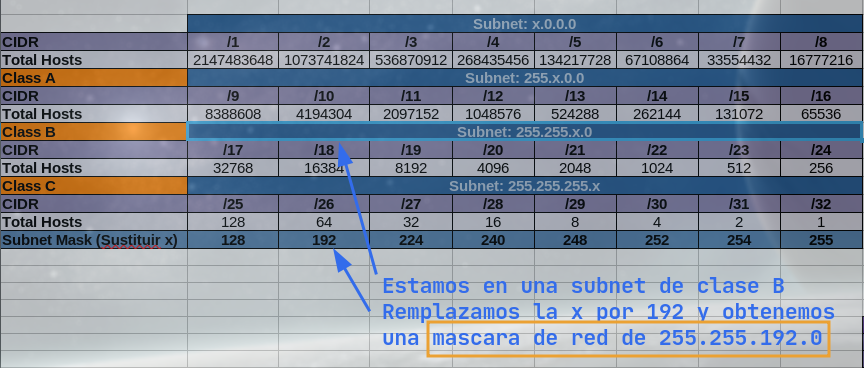
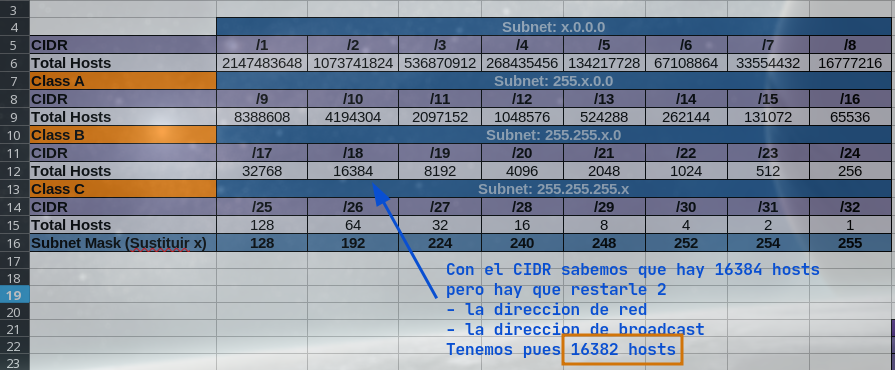
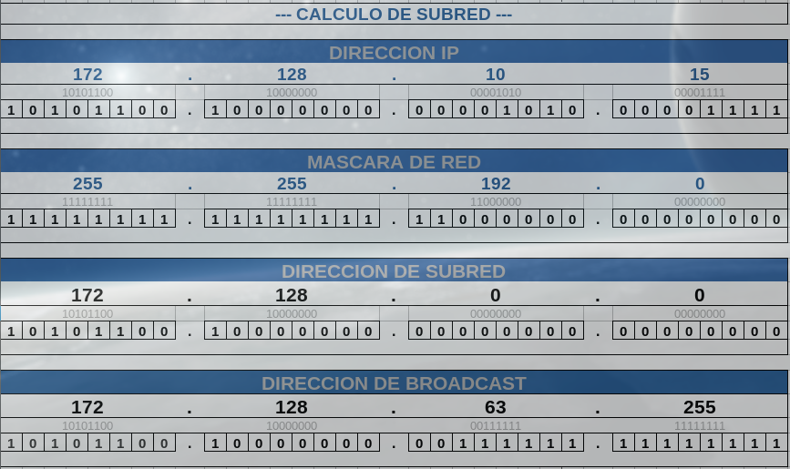

# Exercice, calculs sur sous-reseaux

Avec :

| Description        | IP             |   
|------------------- |--------------- |  
| Adresse IP         | **172.128.10.5** |  
| Masque sous-reseau | **255.255.192.0** |

Déterminer :  

* L'addresse du reseau.
* Nombre d'adresses utilisables.
* Adresse de bloadcast du reseau.
* Plage adressable du reseau.


## Trouver l'addresse de sous-reseau

On passe en binaire les octects de l'addresse IP et du masque de sous-reseau et on fais un **ET logique** sur chaque bit de ceux-ci.  Tool [IpToBin.sh](https://gist.github.com/rnek0/2152fd058edd7a97af2a4b1688761937) pour la conversion.  
- Interpretation du resultat :  
en passant les octets en decimal on obtiens l'addresse du sous-reseau (172.128.0.0).

```bash
10101100.10000000.00001010.00000101  172.128.10.5
11111111.11111111.11000000.00000000  255.255.192.0
-----------------------------------  ET logique
10101100.10000000.00000000.00000000  172.128.0.0

172.128.0.0  -> addresse du sous-reseau
```

---

## Nombre d'addresses utilisables

On sait que :

* **tous les bits a 1** du masque représentent le **nombre de sous-reseaux adressables**
* **tous les bits a 0** du masque représentent le **nombre de machines (hosts) que l'on peut adresser**


MASQUE DE SOUS-RESEAU :

```bash
Pour le masque 255.255.192.0
Sous-reseaux        | Hosts (nombre machines, ici 14 bits)
11111111.11111111.11|000000.00000000           16383 donc + 1 = 16384 - 2
                                               **16382 nombre de hosts**
```

Ce qui veut dire dans nôtre cas pour le nombre de machines (14 bits) : 

11111111111111 (14 bits) en binaire font 16383 ce qui est le plus grand nombre que l'on puisse coder sur 14 bits :

```bash
❯ echo "$((2#11111111111111))"
16383
```

Pour connaître le nombre d'adresses a coder on doit ajouter +1 car les int commencent a zero (0-9) donc on en a **un de plus**.  
Par ailleurs on sait qu'il y a deux addresses IP spéciales qui sont la première et la dernière, donc on retranche 2.

Le **nombre de hosts** est donc : **16382**

## Plage d'adressage

Grâce au masque de sous reseau on connais la partie hôte (nombre de machines)  
On passe tous les host (14 bits) de l'**adresse de sous-reseau** a 1 pour trouver l’adresse de broadcast :

```bash
172.128.0.0 en decimal
10101100.10000000.00000000.00000000  -> addresse de sous-reseau
10101100.10000000.00111111.11111111  -> broadcast (tous les hosts a 1)
```

**172.128.63.255** -> L'**adresse de broadcast** est donc celle ci.

Plage Addressable : 

L'addresse IP de la première machine correspond a celle du sous-reseau **+1**  
L'addresse IP de broadcast **-1** sera le dernier host : 172.128.0.254

 La plage d'adresses va de 172.128.0.1 à 172.128.0.254  

 ---

## Calcul avec CIDR

Dans cet exemple nous avons l'addresse IP 172.128.10.15 puis 18 bits a 1 dans le masque de sous-reseau.  
On a donc **172.128.10.15/18**

On va aller dans notre "cheatsheet" faite avec LibreOffice pour voir dans notre CIDR, on voit qu'on est dans un **subnet Class B** et que l'on doit remplacer le 3eme byte par 192 pour obtenir les mask de sous reseau.



De même on voit le nombre le nombre de machines dans le reseau: **16382**



Nous avons l'addresse IP et le masque de sous-reseau on va les entrer dans notre feuille de calcul pour avoir le reste, c'est à dire l'addresse du reseau et celle de broadcast.



Las herramientas estan en la pagina [Subnetting](../subnetting/#direcciones-especificas-red-y-broadcast)

---