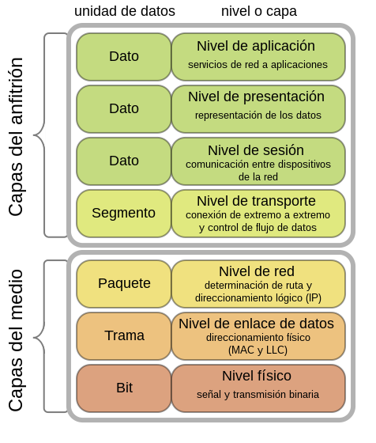

# El modelo OSI

El [modelo OSI](https://es.wikipedia.org/wiki/Modelo_OSI) (International Systems Interconnection) se explica por el hecho de que hay muchos constructores de hardware y si cada uno propusiera su arquitectura de comunicación diferente no habría manera de comprenderse. Para evitar la multiplicación de soluciones de conexión, el ISO (International Standards Organisation) una organización que depende de la ONU y compuesta por mas de una centena de organismos de normalización ha desarrollado **un sistema de referencia para todos**. Cada sistema debe respetar el comportamiento global de la red al ser añadido, modificado o suprimido de ella.  
En 1978, la ISO propuso este modelo bajo la norma ISO IS7498.

Se trata mas de una especificación de lo que tienen que hacer las capas y no de como se deben hacer las cosas, **es un modelo de referencia para los protocolos de la red**. El modelo OSI no es la definición de una topología ni un modelo de red en sí mismo. Tampoco específica ni define los protocolos que se utilizan en la comunicación, ya que estos están implementados de forma independiente a este modelo. Lo que realmente hace OSI es definir la funcionalidad de ellos para conseguir un estándar. **Lo que deben hacer y no como lo hacen**.

## Composición

El modelo OSI está **conformado por 7 capas** o niveles de abstracción. 

* Capa Medio - [Capa 0* (Layer Zero)](https://es.wikipedia.org/wiki/Modelo_OSI#Capa_Medio_-_Capa_0*_(Layer_Zero)) No oficial.

| Capas  | Nombre              | Propósito     |  
| ------ | --------------------| ----------------|  
| **1**  | [**física**](https://es.wikipedia.org/wiki/Capa_física)          | cables de cobre o fibra óptica |  
| **2**  | [**enlace de datos**](https://es.wikipedia.org/wiki/Capa_de_enlace_de_datos)  | transferencia y control de error |  
| **3**  | [**red**](https://es.wikipedia.org/wiki/Capa_de_red) | enrutamiento de paquetes de datos |  
| **4**  | [**transporte     **](https://es.wikipedia.org/wiki/Capa_de_transporte) | control de flujo y la corrección de errores (entre otros) |  
| **5**  | [**sesión         **](https://es.wikipedia.org/wiki/Capa_de_sesi%C3%B3n) | establecimiento, mantenimiento y control de sesiones  |  
| **6**  | [**presentación   **](https://es.wikipedia.org/wiki/Capa_de_presentaci%C3%B3n) | codificación, decodificación, compresión y cifrado de datos |  
| **7**  | [**aplicación     **](https://es.wikipedia.org/wiki/Capa_de_aplicaci%C3%B3n) | servicios para aplicaciones de usuario finales |  

---

  
Image from [wikimedia](https://commons.wikimedia.org/wiki/File:OSI_Model_v1.svg?uselang=es)

---

Existe igualmente el [Modelo TCP/IP](https://es.wikipedia.org/wiki/Modelo_TCP/IP)

TCP/IP es un conjunto de protocolos que permiten la comunicación entre los ordenadores pertenecientes a una red. La sigla TCP/IP significa Protocolo de control de transmisión/Protocolo de Internet. Proviene de los nombres de dos protocolos importantes incluidos en el conjunto TCP/IP, es decir, del protocolo TCP y del protocolo IP.

## Encapsulación de datos

Durante una transmisión, los datos pasan a través de cada una de las capas al nivel de la máquina emisora, de la 7 a la 1. En cada capa se agrega información al paquete de datos, es un **encabezado**, un conjunto de información que garantiza la transmisión.  
En la máquina receptora, al pasar por cada capa (de 1 a 7), se lee la cabecera y luego se borra.  
Así, al recibirlo, el mensaje se encuentra en su estado original.

En cada nivel, el paquete de datos cambia de apariencia, porque se le agrega un encabezado, por lo que los nombres cambian según las capas:

* El paquete de datos se denomina **mensaje** de capa de aplicación [7].
* Luego, el mensaje se encapsula como un **segmento** en la capa de transporte [4].
* El segmento una vez encapsulado en la capa de Internet toma el nombre de **datagrama** [3].
* Finalmente, hablamos de **tramas** a nivel de la capa de acceso a la red .
