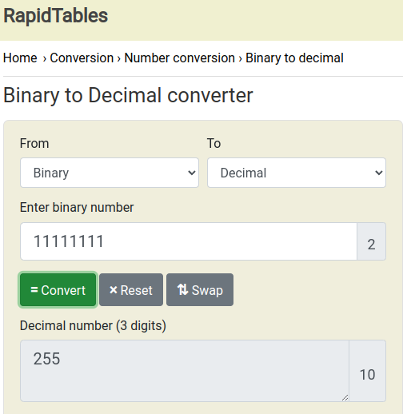

# Subnetting

Imagina que tu maquina tenga que memorizar la Dirección IP de todas las maquinas de internet e igualmente el camino para llegar a ellas. Debería conservar una lista de mil millones y mucho mas de maquinas, y eso no es algo muy optimo. Para que podamos acceder a todos los dispositivos (aunque sea una cámara ip o una tostadora de red) se ha dividido la red en subredes, para que sea mas fácil de utilizar y optimizar los intercambios de información en la red, esas subredes se encargaran de atribuir las Direcciones IP para encontrar las maquinas y distribuir la información.  


Por ello hace falta dos direcciones para identificar a una maquina, una para la subred y otra para la maquina en si. Pero como funciona esto si solo tenemos una dirección IP para identificar una maquina ? Pues añadiendo la dirección de la red, y como encontramos la dirección de la red ? pues con la **mascara de red**.

> La máscara de subred es un separador entre la parte de la red y la parte de la máquina de una dirección IP.  

Puedes ver tu mascara de subred en la configuración de tu tarjeta de red (el campo **netmask**), por ejemplo con el comando [ipconfig](https://fr.wikipedia.org/wiki/Ipconfig) en windows o **ifconfig** en Linux :

```bash
$ ifconfig
eno1: flags=4163<UP,BROADCAST,RUNNING,MULTICAST>  mtu 1500
        inet 192.168.1.16  netmask 255.255.255.0  broadcast 192.168.1.255
...
```

Gracias a la mascara de red tenemos dos identificadores para nuestro ordenador, la Direccion IP y la red. Esto esta a la base del subnetting. De hecho al configurar una interfaz (tarjeta de red) se te pide una IP e igualmente la mascara de red.


Es lo mismo que cuando mandas una carta a alguien, poniendo el nombre de la ciudad, es la oficina de correo de la ciudad la que distribuye a la dirección correcta. Como sabemos, en las ciudades a menudo hay calles o avenidas que tienen el mismo nombre que en otras ciudades. Por ello en casa, en la LAN (local area network) yo puedo tener la misma IP que tu en tu casa, sin embargo la Dirección IP de tu router (el punto de entrada a tu subred hacia tu area local) sera una IP expuesta al exterior de la red. Ese nodo (tu router) tiene dos Direcciones IP en interfaces distintas (una para casa y otra para la calle) es decir una **ip publica** y una **ip privada**.  Un vidéo explicativo por [Alvaro Chirou](https://youtu.be/NfzYr6xVJiM?t=77)

## Direccionamiento y arquitectura de clases de red

En las primeras etapas del desarrollo del Protocolo de Internet,​ los administradores de Internet interpretaban las direcciones IP en dos partes, *los primeros 8 bits* para designar la **dirección de red** y *el resto* para **individualizar la computadora dentro de la red**. Este método pronto probó ser inadecuado, cuando se comenzaron a agregar nuevas redes a las ya asignadas. En 1981 el direccionamiento internet fue revisado y se introdujo la arquitectura de clases. (classful network architecture).​ En esta arquitectura hay tres clases de direcciones IP que una organización puede recibir de parte de la Internet Corporation for Assigned Names and Numbers (ICANN): clase A, clase B y clase C.

* Clase A : el primer octeto identifica la red. De 0 a 127 en su primer octeto.
* Clase B : los dos primeros octetos identifican la red. De 128 a 191 en su primer octeto.
* Clase C : los tres primeros​ octetos identifican la red. De 192 a 223 en su primer octeto.

El diseño de redes de clases (classful) no era escalable y frente a una gran expansión de las redes fue reemplazado por una arquitectura de redes sin clases Classless Inter-Domain Routing (CIDR)​ en el año 1993.

## CIDR

A menudo vemos esta notación : 192.168.1.16**/24** ya veremos con la mascara de subred que el 24 corresponde al numero de bits a 1 llamado **prefijo**.

El numero detrás del "/" es el [**CIDR**](https://es.wikipedia.org/wiki/Classless_Inter-Domain_Routing "Classless Inter-Domain Routing") (Classless Inter-Domain Routing)

Pero como utilizo la "netmask" para conocer la dirección de la red? 

Como sabemos, una IP son 32 bits separados por puntos, es decir 4 octetos separados por puntos. El mayor valor posible de 8 bits en decimal es 255, para hacer el calculo ver [en esta web](https://www.rapidtables.com/convert/number/binary-to-decimal.html) :



Podemos pues decir que nuestra mascara de red en binario es :

11111111.11111111.11111111.00000000

De la misma manera podemos convertir nuestra dirección ip de decimal a binario con [esta utilidad](https://gist.github.com/rnek0/2152fd058edd7a97af2a4b1688761937 "Convert IPv4 to bin") :

11000000.10101000.00000001.00010000

La dirección IP completa se calcula realizando un AND lógico solo con aquellos bits a 1 que indique la máscara de subred (MS). 

|  Direcciones    | Direcciones en binario               | Direcciones en decimal |  
| ------------    | ------------------------------------ | ---------------------- |  
| mascara   :     | 11111111.11111111.11111111.00000000  | 255.255.255.000        |  
| ip        :     | 11000000.10101000.00000001.00010000  | 192.168.001.016        |  
| resultado :     | 11000000.10101000.00000001.00000000  | 192.168.001.000        |  

## Dirección de subred

La parte de **dirección de la subred** es : **192.168.1.0** y el nombre de maquinas permitidas sera 256 (2⁸) pero en realidad hay dos menos, porque ? La primera es la dirección de la red y la ultima la del broadcast; esas dos ip están reservadas, por ello yo pienso que son 254 en este caso.

Para mas calculos de mascaras ver la [hoja de calculo](https://github.com/rnek0/lunarDocs/blob/main/docs/assets/masquesSousReseau.ods) con LibreOffice.

## Direcciones especificas (red y broadcast)

En la red, la primera dirección y la ultima tienen un papel particular :

* La primera est la **dirección de la red**. En nuestro ejemplo : **192.168.1.0**
* La ultima es la dirección de **broadcast**, esta dirección es la que permite transmitir a todas las máquinas de la red. Así, cuando queremos enviar información a todas las máquinas, utilizamos esta dirección. En nuestro ejemplo : **192.168.1.255**

Una [herramienta](https://www.ipaddressguide.com/cidr) para ejercicios sobre calculos de subredes a partir del CIDR

<div style="text-align:center;">
  <form action="https://www.ipaddressguide.com/cidr" method="post" target="_blank" >
    <p style="background:#fff;color:#000;border:1px solid #99A8AE;width:280px;padding:5px 5px 5px 5px;font-size:11px;font-family:'Trebuchet MS',Arial,Sans-serif;"><a href="https://www.ipaddressguide.com" target="_blank"></a><br />
	<b>CIDR to IPv4 Conversion</b><br />
	<label>CIDR</label><br />
	<input type="text" name="cidr" value="" style="border:solid 1px #C0C0C0;font-size:9px;width:210px;" /><br />
	<input type="submit" value="Calculate" style="width:210px;font-size:10px;margin-top:6px;padding:2px 3px;color:#FFF;background:#8EB50C;border-width:1px;border-style:solid 1px;">
    </p>
  </form>
</div>