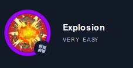

# Explosion

  
Windows

Dans cette activité on voit des concepts qui se referent au travail avec des outils de communication à distance.

## Cli tools - Outils d'accès à distance 

Les outils d'accès à distance basés sur **l'interface de ligne de commande** existent depuis toujours.
- Notion du TAP (Traffic Access Point)
- TCP & Telnet vs SSH (SSH utilise la cryptographie à clé publique pour vérifier l'identité de l'hôte distant)

## GUI tools - Outils d'accès à distance 

Les outils d'accès à distance basés sur **l'interface utilisateur** graphique sont plus récents.

## Un début de Enumeration 

Un début d'enumeration avec **nmap** et ```le flags -sV``` (découverte des versions des services)

Certains ports intéressants :

- 135 TCP
- 139 TCP
- 445 TCP
- 3389 TCP
- 5357 TCP

## xfreerdp

**xfreerdp** est un client **RDP** (Remote Desktop Protocol) X11 qui fait partie du projet FreeRDP. Un serveur RDP est intégré à de nombreuses éditions de Windows. Les serveurs alternatifs incluaient xrdp et VRDP (VirtualBox).