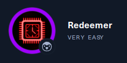

# Redeemer

  
Linux 

La machine Redeemer est une introduction a l'universe des bases de donées **NoSQL** avec **Redis**.

## Qu’est-ce que Redis ?

Redis (REmote DIctionary Server) est un magasin de données clé-valeur NoSQL avancé open source utilisé comme base de données, cache et courtier de messages. Les données sont stockées dans un format de dictionnaire comportant des paires clé-valeur. C'est
généralement utilisé pour le stockage à court terme de données nécessitant une récupération rapide. Redis sauvegarde les données sur les disques durs pour assurer la cohérence.